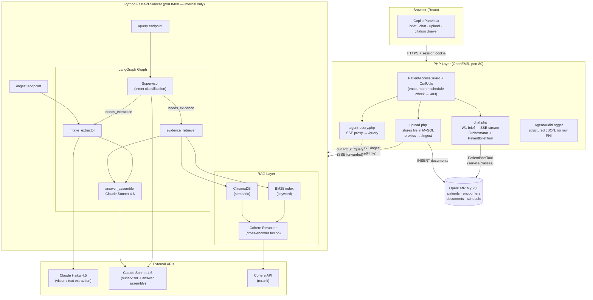

# Clinical Co-Pilot — Week 2 Demo Script (AgentForge)

> Audience: technical reviewers at a Gauntlet AI sprint.
> Target runtime: **5 minutes**.

---

## 1. Architecture Diagram

---

## 2. Why Each Component Exists

### LangGraph supervisor

The supervisor is the traffic cop. It reads the physician's query plus current state (extracted docs already cached? guideline chunks already fetched?) and emits a structured routing decision: `needs_extraction`, `needs_evidence`, or `can_answer`. That decision is persisted as JSON in the routing log, so every query is auditable after the fact. Without a supervisor, every request would invoke every worker regardless of what it actually needs — wasting tokens and latency.

### intake_extractor node

When a lab PDF or intake form is uploaded, the system needs to turn a document blob into a typed, validated data structure the rest of the graph can reason over. The extractor writes its output into an in-memory cache keyed by OpenEMR document ID. When the physician later asks "what does this lipid panel mean?", the graph skips re-calling Claude and reads from the cache — extraction happens once per upload, not once per question.

### evidence_retriever node (BM25 + ChromaDB hybrid + Cohere rerank)

Clinical guidelines use exact terminology that matters: "LDL-C < 70 mg/dL for very-high-risk patients" is not the same sentence paraphrased differently. Pure semantic search (embeddings) can miss exact threshold values. Pure keyword search (BM25) misses paraphrased queries. Running both and then re-ranking with a Cohere cross-encoder — which scores each candidate chunk jointly against the full query string — gets the right section of the right guideline most reliably. Cohere is optional: if no API key is present the system falls back to the raw retrieval scores.

### answer_assembler node

This is the only node that calls Claude Sonnet 4.6 and writes the final answer to the physician. It receives the query, the patient context string, the extracted document data, and the retrieved guideline chunks. Its prompt enforces two hard rules: every guideline claim must carry an inline `[[GN]]` citation, and if the query requests a specific prescribing or diagnostic decision the model must disclaim and redirect rather than answer. The constraint is in the prompt, not in post-processing, so it applies to every response path.

### PHP proxy layer (why not call Anthropic directly from JS?)

Three reasons. First, the Anthropic API key must never reach a browser. Second, every request must pass through session validation, CSRF checking, and PatientAccessGuard — which checks that the logged-in physician has either a prior encounter or a scheduled appointment with this specific patient — before anything reaches the Python sidecar. Third, PHP is already the OpenEMR request lifecycle. Keeping auth, audit logging, and database writes there avoids splitting those responsibilities across three runtimes.

### pdfplumber + Haiku Vision two-path extraction

Lab reports arrive in two flavors: PDFs generated by digital systems (with selectable embedded text) and PDFs that are scanned paper (images inside a PDF wrapper). pdfplumber can extract text from the first kind cheaply. For the second, it renders each page to PNG and sends it to Claude Haiku via the vision API. Haiku is used instead of Sonnet because extraction is a mechanical task — read the table, output JSON — and Haiku does it accurately at roughly one-tenth the cost.

### Citation markers `[[N]]` and `[[GN]]`

Every claim in the answer needs to be traceable to a source so the physician can verify it. Two namespaces exist because the sources have different epistemic status. `[[N]]` (blue in the UI) refers to a patient-record document — something the patient or clinic provided. `[[GN]]` (purple) refers to a chunk from the clinical guideline corpus — published evidence. Keeping them visually distinct lets the physician instantly know whether a claim comes from the patient's own data or from a guideline, which affects how they should weight it.

---

## 3. Demo Script

> Format: Time | What to click / show | What to say

| Time | Action | What to Say |
|------|--------|-------------|
| 0:00 | Open OpenEMR at the deployed URL. Navigate to Margaret Chen's patient chart. The CopilotPanel is visible in the sidebar. A spinner shows the brief loading. | "This is OpenEMR — an open-source EHR used by real clinics. We've embedded a Clinical Co-Pilot panel directly in the chart. The moment a physician opens a patient, the panel starts building a pre-visit briefing from the patient's actual records." |
| 0:15 | The brief finishes streaming. Visible: chief complaint, active conditions, meds, last vitals, inline `[[1]]` `[[2]]` citation badges. | "The brief pulls from OpenEMR's service layer — demographics, encounters, prescriptions, labs. You'll see numbered citation markers on clinical claims." |
| 0:45 | Click the `[[1]]` badge. A slide-out drawer opens: source type, encounter date, and the raw field value. | "Clicking any citation opens a sourcing drawer. This one traces back to a specific encounter note — the raw database row, not another AI summary. Blue badge means patient record. If it were purple, it's a clinical guideline. Two distinct namespaces because those sources have different weight." |
| 1:00 | Close the drawer. Point to the suggested-query pill row at the bottom of the panel. | "The W1 brief covers what we already know. Week 2 adds the ability to answer evidence-based questions in real time." |
| 1:15 | Click the pill: **"What do guidelines say about hyperlipidemia management?"** A loading indicator appears. | "This query goes through a different path — it hits our Python FastAPI sidecar and the LangGraph multi-agent graph." |
| 1:30 | The answer appears, streaming. It contains inline `[[G1]]`, `[[G2]]` markers in purple. Example visible text: "For patients with established ASCVD, ACC/AHA guidelines recommend high-intensity statin therapy [[G1]] targeting LDL-C below 70 mg/dL [[G2]]." | "The purple G-markers are guideline citations. Every guideline claim must have one — that's a hard rule in the answer assembler's prompt. The model cannot produce an unsourced clinical guideline claim." |
| 2:15 | Click the `[[G1]]` purple badge. Drawer opens: source label 'ACC/AHA 2023 §2.1', the excerpt text, relevance score. | "The purple drawer shows the exact guideline section and the text excerpt we retrieved. The physician reads the source before acting on it. This is the difference between an AI that says 'trust me' and one that shows its work." |
| 2:30 | Close the drawer. Click the upload button (paperclip icon). Select a lipid panel PDF. Upload progress shows. | "Now for Week 2's document ingestion. I'm uploading a lipid panel PDF — imagine the patient brought this from a recent lab visit." |
| 2:45 | Upload completes. An extraction preview table appears below the upload button: test name, value, unit, reference range, flag. LDL-C row shows "142 mg/dL" with a red "H" flag. | "Within a few seconds the sidecar extracted every row into a Pydantic-validated schema. pdfplumber tried the text layer first — fast and cheap. If the PDF had been a scan, it would have fallen back to Claude Haiku vision. Either path produces the same output schema." |
| 3:15 | Point to the patient snapshot card at the top of the panel. The Labs row now reflects the new LDL-C value. | "The snapshot card updates with the ingested values. The physician sees current lab numbers without any manual re-entry." |
| 3:45 | Type in the query box: **"What should I prescribe for this lipid panel?"** Submit. | "I'll now ask something that crosses a line — a specific prescribing decision." |
| 4:00 | Answer appears. First sentence: "I can't make specific clinical decisions, but guidelines offer the following context:" — followed by `[[G1]]` `[[G2]]` citations. | "The system declines to prescribe. That disclaimer is baked into the answer assembler's prompt, not into a filter applied afterward. It doesn't block the response — it redirects to evidence. The physician still gets the relevant guidelines; the decision stays with them." |
| 4:15 | Switch to the architecture diagram (or scroll up in the document). Point to the LangGraph subgraph. | "Here's what just happened. The supervisor read 'what should I prescribe' and classified it as `needs_evidence`. The extracted doc was already in cache, so it skipped the intake_extractor and routed straight to evidence_retriever. BM25 and ChromaDB ran in parallel, Cohere re-ranked the top candidates, and the answer assembler received the five most relevant chunks." |
| 4:30 | Point to the PHP layer in the diagram. | "Nothing in that path was reachable from the browser directly. Every request flows through PHP first — session check, CSRF, PatientAccessGuard. The sidecar is on 127.0.0.1 port 8400 and not reachable externally. API keys never leave the server." |
| 4:45 | Return to the live panel. | "That's Week 2: document extraction, hybrid RAG, LangGraph routing, and machine-readable citations at two namespaces. Week 3 would add ambient encounter transcription, real-time alert injection during the visit, and an expanded 50-case eval suite with a PR-blocking CI gate. Thanks." |

---

## 4. Architecture Slide Talking Points

- **Two citation namespaces signal two epistemic sources.** `[[N]]` (blue) is a fact the patient brought with them. `[[GN]]` (purple) is a fact from published evidence. A physician should weight these differently — the UI enforces that distinction visually without the physician having to ask.

- **The supervisor's routing decision is structured JSON, not prose.** Every query leaves an auditable trail: which workers ran, in what order, how long each took, and what reasoning the supervisor gave. In a regulated environment you can reconstruct the full decision path for any answer the system produced.

- **The PHP layer is not legacy indirection — it is the security boundary.** PatientAccessGuard checks that the logged-in physician has a prior encounter or a scheduled appointment with this patient before any query reaches the sidecar. One SQL check, but it prevents a valid session from being used to query an arbitrary patient chart.

- **pdfplumber + Haiku vision costs roughly $0.002 per lab page.** The two-path design means text-layer PDFs — the majority — skip the vision API entirely and cost an order of magnitude less. Haiku only fires when pdfplumber returns fewer than 100 printable characters. Cost scales with document complexity, not document count.
