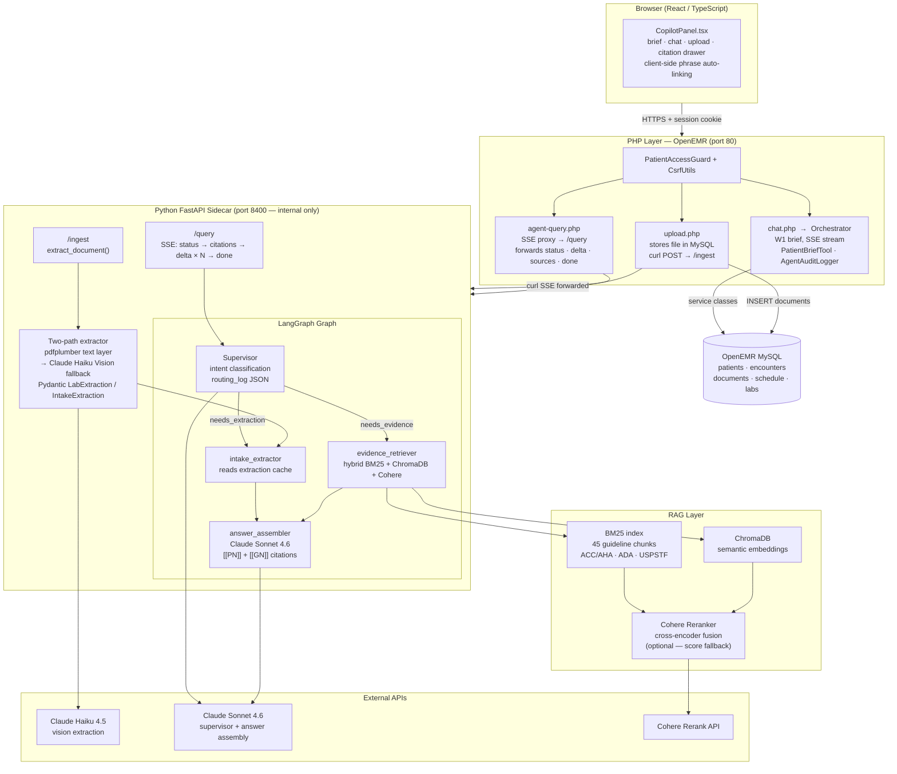

# Clinical Co-Pilot — Week 2 Demo Script (AgentForge)

> Audience: technical reviewers at a Gauntlet AI sprint.
> Target runtime: **4–5 minutes**.
> Live URL: http://198.211.103.246.nip.io — login admin / pass, open Margaret Chen's chart.

---

## 1. Architecture Diagram

---

## 2. Why Each Component Exists

### LangGraph supervisor
The supervisor is the traffic cop. It reads the physician's query plus current state (docs already extracted? guideline chunks already fetched?) and emits a structured routing decision: `needs_extraction`, `needs_evidence`, or `can_answer`. That decision is persisted as a JSON routing log, so every query is auditable. Without a supervisor, every request would invoke every worker regardless of need — wasting tokens and latency.

### intake_extractor node
When a lab PDF or intake form is uploaded, the system needs to turn a document blob into a typed, validated data structure the rest of the graph can reason over. The extractor writes its output into an in-memory cache keyed by OpenEMR document ID. When the physician later asks "what does this lipid panel mean?", the graph skips re-calling Claude and reads from the cache — extraction happens once per upload, not once per question.

### evidence_retriever (BM25 + ChromaDB hybrid + Cohere rerank)
Clinical guidelines use exact terminology that matters: "LDL-C < 70 mg/dL for very-high-risk patients" is not the same sentence paraphrased differently. Pure semantic search misses exact threshold values. Pure keyword search misses paraphrased queries. Running both and re-ranking with a Cohere cross-encoder — which scores each candidate chunk jointly against the full query — gets the right section of the right guideline most reliably.

### answer_assembler node
The only node that writes the final answer. Its prompt enforces two hard rules: every guideline claim must carry an inline `[[GN]]` citation, and if the query requests a specific prescribing or diagnostic decision the model must disclaim and redirect rather than answer. These constraints are in the prompt, not post-processing, so they apply to every response path.

### PHP proxy layer
Three reasons. First, API keys never reach a browser. Second, every request passes through session validation, CSRF checking, and PatientAccessGuard — which checks that the logged-in physician has a prior encounter or scheduled appointment with this specific patient — before anything reaches the sidecar. Third, PHP is already the OpenEMR request lifecycle; keeping auth, audit logging, and database writes there avoids splitting those responsibilities across runtimes.

### Two-path extraction (pdfplumber + Haiku Vision)
Lab reports arrive in two flavors: PDFs with embedded selectable text (generated by digital systems) and PDFs that are scanned paper (images). pdfplumber extracts text from the first kind cheaply. For scans, it renders each page to PNG and sends it to Claude Haiku via the vision API. Haiku is used instead of Sonnet because extraction is a mechanical table-reading task — accurate at roughly one-tenth the cost.

### Citation namespaces `[[N]]`, `[[PN]]`, `[[GN]]`
Every claim needs to be traceable. Three namespaces exist:
- `[[N]]` (blue) — patient record facts from the initial brief (appointment, encounter, meds, labs)
- `[[PN]]` (blue) — patient record facts cited by the agent in follow-up responses
- `[[GN]]` (purple) — clinical guideline chunks

Blue means "the patient or clinic provided this". Purple means "published evidence". Visually distinct so the physician instantly knows which epistemic source they're looking at. The UI also performs client-side phrase matching: if the LLM forgets to cite a known drug name or diagnosis, the front-end scans the response text against the sources map and auto-links it.

---

## 3. Demo Script

> Format: Timestamp | Action | Talking point

| Time | Action | What to Say |
|------|--------|-------------|
| 0:00 | Navigate to Margaret Chen's chart. CopilotPanel visible. Brief is streaming in. | "This is OpenEMR — an open-source EHR used by real clinics. We embedded a Clinical Co-Pilot directly in the chart. The moment a physician opens a patient, it starts building a pre-visit briefing from the patient's actual records." |
| 0:20 | Brief finishes. Point to inline blue `[[1]]` `[[3]]` citation badges on med/lab phrases. | "The brief pulls from OpenEMR's service layer — encounters, prescriptions, labs, today's appointment reason. Every clinical claim carries a numbered citation badge." |
| 0:40 | Click a blue badge (e.g. on a medication name). Source drawer opens: type, label, raw field value, link to chart section. | "Clicking any badge opens a sourcing drawer — not another AI summary, but the actual database row. Blue badge means patient record. Purple would mean clinical guideline. Two distinct namespaces because those sources have different weight when a physician makes a decision." |
| 1:00 | Close drawer. Point to the 3 suggestion chips at the bottom. | "Three follow-up chips are generated every time — one about the patient's medications, one about context or history, one about the most relevant clinical guideline." |
| 1:10 | Click the guideline chip: "What do guidelines say about [condition]?" A pulsing dot and status text appear: "Searching clinical guidelines…" | "This goes through a different path — hits our Python FastAPI sidecar and a LangGraph multi-agent graph. The pulsing indicator is a live status event from the sidecar, not a spinner we faked." |
| 1:30 | Answer streams in. Purple `[[G1]]` `[[G2]]` badges visible on guideline claims. | "Purple G-badges are guideline citations. Every guideline claim must have one — it's a hard constraint in the answer assembler prompt. The model cannot produce an unsourced guideline claim." |
| 1:50 | Click a purple `[[G1]]` badge. Drawer shows guideline source, ACC/AHA section, excerpt text. | "The drawer shows the exact guideline section and the retrieved text excerpt. The physician reads the source before acting on it. This is the difference between an AI that says 'trust me' and one that shows its work." |
| 2:10 | Close drawer. Click the upload (paperclip) button. Drop a lipid panel PDF. | "Now for Week 2's document ingestion. I'm uploading a lab report — imagine the patient brought this from a recent visit outside the system." |
| 2:25 | Upload completes. Extraction preview table appears: test names, values, units, flags. LDL row shows elevated value with red H flag. | "Within seconds the sidecar extracted every row into a Pydantic-validated schema. pdfplumber tried the text layer first — fast and cheap. If the PDF were a scan, it falls back to Claude Haiku vision. Either path produces the same typed output." |
| 2:45 | Point to the snapshot card at the top. Labs row has updated with the new results. | "The snapshot card updates immediately. The physician sees the current numbers without manual re-entry." |
| 3:00 | Type: "What should I prescribe for this lipid panel?" and submit. | "I'll ask something that crosses a line — a specific prescribing decision." |
| 3:15 | Answer appears. First sentence: "I can't make specific clinical decisions, but guidelines offer the following context:" followed by `[[G1]]` `[[G2]]` citations. | "The system declines to prescribe. That disclaimer is in the answer assembler's prompt — it doesn't block the response, it redirects to evidence. The decision stays with the physician." |
| 3:30 | Switch to architecture diagram. Point to LangGraph subgraph. | "Here's what just ran. The supervisor saw 'what should I prescribe' and classified it as needs_evidence. The extracted doc was already in cache, so it skipped the intake_extractor and routed straight to evidence_retriever. BM25 and ChromaDB ran, Cohere re-ranked the top candidates, answer assembler got the five most relevant guideline chunks." |
| 3:45 | Point to the PHP layer in the diagram. | "Nothing in that path was reachable from the browser. Every request flows through PHP first — session check, CSRF, PatientAccessGuard verifying the physician has a clinical relationship with this patient. The sidecar is on port 8400, internal only. API keys never leave the server." |
| 4:00 | Return to the panel. | "That's Week 2: document extraction, hybrid RAG, LangGraph routing, and machine-readable citations at two namespaces. Week 3 would add ambient encounter transcription, real-time alert injection during the visit, and a 50-case eval suite with a PR-blocking CI gate. Thanks." |

---

## 4. Architecture Talking Points

**Two citation namespaces signal two epistemic sources.**
`[[N]]` / `[[PN]]` (blue) is a fact the patient or clinic provided. `[[GN]]` (purple) is a fact from published evidence. A physician weights these differently — the UI enforces that distinction visually.

**The supervisor's routing decision is structured JSON, not prose.**
Every query leaves an auditable trail: which workers ran, in what order, how long each took, and what reasoning the supervisor gave. In a regulated environment you can reconstruct the full decision path for any answer the system produced.

**The PHP layer is not legacy indirection — it is the security boundary.**
PatientAccessGuard checks that the logged-in physician has a prior encounter or a scheduled appointment with this patient before any query reaches the sidecar. One SQL check that prevents a valid session from querying an arbitrary patient chart.

**pdfplumber + Haiku vision costs roughly $0.002 per lab page.**
The two-path design means text-layer PDFs — the majority — skip the vision API entirely. Haiku only fires when pdfplumber returns fewer than 100 printable characters. Cost scales with document complexity, not document count.

**Client-side phrase matching as a citation safety net.**
Even if the LLM misses an explicit `[[PN]]` citation, the front-end scans every non-streaming response against the known sources map (drug names, test names, diagnoses) and auto-wraps matching phrases. The physician gets clickable citations either way.
