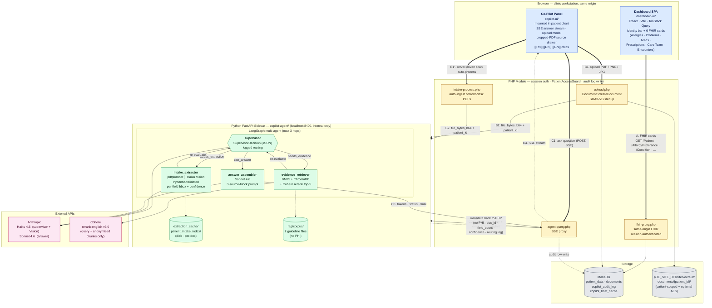

# W2 Architecture: Multimodal Evidence Agent

**Sprint:** Week 2 — AgentForge Clinical Co-Pilot
**Date:** 2026-05-09 (final-submission revision)
**Deployed:** https://198.211.103.246.nip.io  (Caddy HTTPS · sidecar systemd)
**Builds on:** `ARCHITECTURE.md` (Week 1 single-agent brief)
**Companion docs:** `PATIENT_DASHBOARD_MIGRATION.md` (surprise-challenge React port), `COST_ANALYSIS.md` (cost + p50/p95 latency)
**Traces to:** `USERS.md` UC-1 (pre-encounter brief), UC-2 (medication review), UC-4 (lab trends)

---

## Executive Summary

Week 1 delivered a single-agent system: a PHP orchestrator reads structured OpenEMR data, calls Claude, and streams a cited pre-encounter brief to the physician. The verification model is strong — every claim is pinned to a numbered source record — but the agent is blind to the unstructured documents that carry the most clinically relevant recent information: scanned lab reports and intake forms uploaded by front-desk staff.

Week 2 adds three capabilities on top of that foundation without replacing it.

**Capability 1 — Document ingestion with schema-validated extraction.** A new `attach_and_extract` tool accepts a file (lab PDF or intake form), converts pages to images, sends each to Claude Vision, and forces the raw output through a Pydantic schema before any extracted fact is stored or surfaced. Schema validation is the primary defense against VLM hallucination — a field that cannot be read with sufficient confidence is emitted as `null` with a warning, not silently invented. Every extracted fact links back to a source document page so the physician can verify against the original scan.

**Capability 2 — Hybrid RAG with rerank over a clinical-guideline corpus.** A small corpus of primary-care guidelines (ACC/AHA hypertension, ADA diabetes standards, USPSTF preventive care) is indexed with both BM25 keyword retrieval and dense embeddings. When the supervisor determines a query requires guideline evidence, the evidence-retriever worker runs a hybrid search, reranks candidates via Cohere Rerank, and returns cited snippets to the answer model. Guideline evidence and patient-record facts are always two distinct citation types — never mixed in the same claim.

**Capability 3 — Multi-agent orchestration with logged handoffs.** A LangGraph supervisor receives the physician's query and current patient context, then decides: does this need document extraction? Evidence retrieval? Or is the existing record data sufficient? The routing decision is a logged, structured JSON output from a named node — not an implicit choice buried in a prompt. Each worker (intake-extractor, evidence-retriever) has one narrow responsibility.

**The architectural shift from Week 1:** Week 1 runs entirely in PHP. Week 2 adds a Python FastAPI sidecar that owns the multi-agent graph, document extraction, and RAG. The PHP module continues to serve the Week 1 brief flow unchanged and proxies document-related queries to the sidecar. This keeps the Week 1 surface stable while enabling the Python ecosystem (LangGraph, Pydantic, ChromaDB, rank-bm25, Cohere) Week 2 requires.

**The eval gate is not optional.** 50 boolean-rubric eval cases with a PR-blocking Git Hook are part of the deliverable. During grading, a regression will be injected and the gate must catch it.

---

## 1. System Overview

The current architecture, end to end. Three browser surfaces share the same origin as OpenEMR; a thin PHP module owns auth and audit; a Python FastAPI sidecar (internal-only) owns the multi-agent graph, document extraction, and RAG; storage and external APIs are separated so PHI can be reasoned about explicitly.



**Three flows worth tracing on the diagram:**

- **A — Dashboard load.** The React dashboard hits `fhir-proxy.php` for each card; PHP authenticates via the existing OpenEMR session, calls the FHIR service classes server-side, and returns FHIR JSON. The browser never holds a token.
- **B — Document ingest.** The Co-Pilot uploads a file to `upload.php`, which writes it through `Document::createDocument` (SHA3-512 dedup, encrypted patient-scoped disk path) and returns the `openemr_doc_id`. PHP forwards the bytes to the sidecar's `/ingest`, which runs the two-path extractor (pdfplumber for digital PDFs, Haiku Vision for scans), validates against the Pydantic schema, and stores results in the per-doc disk cache. The sidecar never opens a DB connection — extracted facts return to PHP and the browser, and the audit row is written PHP-side.
- **C — Agent query.** A question from the Co-Pilot panel hits `agent-query.php` (SSE proxy), which forwards to the sidecar's `/query` along with the patient-context snapshot. The LangGraph supervisor emits a structured `SupervisorDecision`, routes to `intake_extractor` and/or `evidence_retriever` (max 3 hops), then to `answer_assembler`. The Sonnet answer is streamed token-by-token back through PHP to the browser; status events from each graph node render in the message bubble live.

---

## 2. Week 1 / Week 2 Boundary

The PHP module continues to own the existing brief flow exactly as built in Week 1. No existing code is modified. Week 2 adds two new PHP endpoints that proxy to the Python sidecar:

| Endpoint | Owner | Flow |
|---|---|---|
| `POST /api/copilot/chat` | PHP (existing) | Week 1 brief + follow-up, SSE stream |
| `POST /api/copilot/upload` | PHP only | Stores file in OpenEMR, returns `openemr_doc_id`, triggers sidecar extraction |
| `POST /api/copilot/agent-query` | PHP → Python sidecar | Multi-agent query with RAG, returns SSE |

The sidecar runs on `localhost:8400` and is not reachable from outside the OpenEMR server. The PHP layer validates the OpenEMR session and passes a signed patient context to the sidecar — the sidecar never reads `$_SESSION` or the OpenEMR auth layer directly.

---

## 3. Document Ingestion Flow

### 3.1 OpenEMR's Existing Document Store

OpenEMR ships with a complete document management system. We use it rather than building a parallel one.

**How it works:**
- `Document::createDocument()` in `library/classes/Document.class.php` accepts a file, writes it to disk, and inserts the `documents` row in one call.
- **Files on disk:** `$OE_SITE_DIR/sites/default/documents/{patient_id}/{drive_uuid}` — patient-scoped, outside the web root, optional AES encryption via `drive_encryption` config.
- **`documents` table** stores `foreign_id` (patient PID), `mimetype`, `name`, SHA3-512 `hash`, `drive_uuid`, and `encounter_id`. The hash is how OpenEMR deduplicates re-uploads of the same file.
- **FHIR round-trip:** every stored document is automatically accessible as a `DocumentReference` resource at `/fhir/Binary/{uuid}` — no extra work required for FHIR compliance.
- **Category system:** documents are organized hierarchically. We register a "Co-Pilot Uploads" category at first-run and file all agent-ingested documents under it.
- **Retrieval:** `Document->get_data()` returns decrypted file bytes regardless of storage method; `Document->get_filesystem_filepath()` returns the absolute path on disk.

**We do not build our own file storage.** The PHP upload handler calls `Document::createDocument()` and gets back an OpenEMR `document_id`. That ID drives everything downstream.

### 3.2 Document Taxonomy (from example corpus)

Reviewing the actual example documents reveals two distinct input classes that warrant different extraction paths:

| Class | Examples | Characteristic |
|---|---|---|
| **Digital PDF** | Chen lipid panel, Whitaker CBC, Kowalski CMP, Chen intake, Whitaker intake | Real text layer — `pdfplumber` extracts text directly |
| **Image file** | Reyes HbA1c (dark-background photo), Reyes intake (clean scan), Kowalski intake (angled photo, rubber stamp, handwritten checkboxes) | No text layer — vision model required |

5 of the 8 example documents are digital PDFs. The digital intake forms (Chen, Whitaker) have RxNorm and SNOMED codes embedded in the text — free structured data we'd lose by going through a vision model unnecessarily.

### 3.3 Two-Path Extraction

**Path A — Digital PDFs (text layer present)**

`pdfplumber` extracts per-page text and character-level bounding boxes. The text goes to **Claude Haiku** (text-only) for structured field extraction. This is ~10× cheaper than sending images to a vision model and more accurate because there is no OCR step to introduce errors. The `CO₂` artifact (`CO&sub2;` in raw PDF text) is an example of why an LLM still sits on this path — Haiku normalises encoding artifacts without special-casing.

**Path B — Image files and image-only PDF pages**

**Claude Haiku Vision** (not Sonnet). The example images are printed forms — clean enough that Haiku Vision handles them reliably. Haiku Vision is ~6× cheaper per image token than Sonnet. The only genuinely hard case is the Kowalski ER intake: angled perspective, rubber stamp overlay, handwritten checkbox marks. Haiku Vision gets the field values right even on this; bounding boxes for the citation overlay are approximate and fall back to page-level highlight with a warning.

Upgrade to Sonnet Vision only if eval results show Haiku missing fields on image cases — don't start there.

**Path detection logic:**

```python
def extraction_path(file_bytes: bytes, mimetype: str) -> Literal["text", "vision"]:
    if mimetype == "application/pdf":
        text = pdfplumber_extract(file_bytes)
        return "text" if len(text.strip()) > 100 else "vision"
    return "vision"  # PNG / JPG always vision
```

### 3.4 Upload and Extraction Flow

```
Browser drag-drop / file picker
        │
        ▼
  POST /api/copilot/upload  (PHP)
  ├── Session auth + PatientAccessGuard
  ├── Validate file type (PDF / PNG / JPG only)
  ├── Document::createDocument(
  │       patient_id, category_id="Co-Pilot Uploads",
  │       filename, mimetype, file_bytes)
  │   — dedup: SHA3-512 hash match → return existing doc_id
  └── Returns {openemr_doc_id, doc_uuid}
        │
        ▼
  PHP reads file bytes via Document->get_data()
  POST to Python sidecar /ingest
  {patient_id, openemr_doc_id, doc_type, file_bytes_b64, mimetype}
        │
        ▼
  Python: detect extraction path
  ├── PDF with text layer  → pdfplumber text + bounding boxes
  │                           → Claude Haiku (text-only) → raw JSON
  └── Image / scan         → Claude Haiku Vision → raw JSON
        │
        ▼
  Pydantic schema validation
  (ValidationError → extraction fails explicitly, not silently)
        │
        ▼
  Confidence threshold: fields < 0.8 → emitted as null + warning
        │
        ▼
  Write to copilot_documents (FK → documents.id)
  Write derived lab results → procedure_result
  Return ExtractionResult + citation registry to PHP
        │
        ▼
  PHP returns extraction summary + doc_id to browser
```

**Cost comparison vs. original plan (Sonnet Vision for everything):**

| Document type | Original plan | Revised plan | Saving |
|---|---|---|---|
| Digital lab PDF (2 pages) | ~$0.012 (Sonnet Vision) | ~$0.002 (Haiku text) | ~83% |
| Scanned intake form (2 pages) | ~$0.024 (Sonnet Vision) | ~$0.008 (Haiku Vision) | ~67% |
| Image-only file (1 page) | ~$0.012 (Sonnet Vision) | ~$0.004 (Haiku Vision) | ~67% |

**Production note:** At scale, AWS Textract Form Parser ($0.0015/page, native bounding boxes, checkbox detection) is the right swap for the image path. Not worth the AWS account setup for this sprint.

### 3.5 Pydantic Schemas

**LabExtraction**
```python
class LabResult(BaseModel):
    test_name: str
    value: str
    unit: str | None
    reference_range: str | None
    collection_date: str | None          # ISO 8601 or null
    abnormal_flag: Literal["H", "L", "C", "N"] | None
    confidence: float = Field(ge=0.0, le=1.0)
    source_citation: SourceCitation

class LabExtraction(BaseModel):
    doc_type: Literal["lab_pdf"]
    patient_id: int
    openemr_doc_id: int                  # FK → documents.id
    results: list[LabResult]
    extraction_warnings: list[str]
```

**IntakeExtraction**
```python
class IntakeExtraction(BaseModel):
    doc_type: Literal["intake_form"]
    patient_id: int
    openemr_doc_id: int
    demographics: Demographics | None
    chief_concern: str | None
    current_medications: list[MedicationEntry]
    allergies: list[AllergyEntry]
    family_history: list[str]
    source_citation: SourceCitation
    extraction_warnings: list[str]
```

**SourceCitation** (shared across doc types and RAG chunks)
```python
class SourceCitation(BaseModel):
    source_type: Literal["lab_pdf", "intake_form", "guideline_chunk", "openemr_record"]
    source_id: str       # documents.uuid (hex) or OpenEMR record ID
    page_or_section: str # "page 2" or "Section 4.3"
    field_or_chunk_id: str
    quote_or_value: str  # verbatim text from source
```

### 3.6 Database — copilot_documents as Metadata Sidecar

`copilot_documents` is a **metadata sidecar** to OpenEMR's existing `documents` table. It tracks extraction state; the file itself lives in OpenEMR's document store and is always retrieved through `Document->get_filesystem_filepath()`.

```sql
CREATE TABLE copilot_documents (
    id              BIGINT AUTO_INCREMENT PRIMARY KEY,
    openemr_doc_id  INT NOT NULL UNIQUE,        -- FK → documents.id
    patient_id      INT NOT NULL,
    doc_type        ENUM('lab_pdf', 'intake_form') NOT NULL,
    page_count      TINYINT NOT NULL,
    mean_confidence FLOAT,
    extraction_warnings JSON,                   -- flagged low-confidence fields
    extracted_at    DATETIME NOT NULL,
    physician_id    INT NOT NULL,
    INDEX idx_patient (patient_id),
    CONSTRAINT fk_openemr_doc FOREIGN KEY (openemr_doc_id) REFERENCES documents(id)
);
```

Extracted lab results go into `procedure_result` using the same schema as results from lab instruments. A `source = 'copilot_extracted'` marker and a `foreign_reference_id` pointing to `copilot_documents.id` distinguish agent-extracted rows from instrument rows. Before inserting, a lookup on `(patient_id, test_name, collection_date, foreign_reference_id)` prevents re-extraction of the same document from creating duplicates.

---

## 4. Hybrid RAG Design

### 4.1 Corpus

A small, curated set of guideline chunks (~50 chunks, ~200 tokens each) covering:
- ACC/AHA 2023 Hypertension Guidelines — key thresholds, treatment ladder
- ADA 2025 Standards of Diabetes Care — glycemic targets, medication tiers
- AHA/ACC 2018 Cholesterol Management — statin intensity tiers, LDL targets
- ACC/AHA 2023 Atrial Fibrillation — rate vs rhythm, anticoagulation
- GINA 2024 Asthma — SABA-only abandonment, ICS-formoterol stepwise plan
- USPSTF Preventive Services (primary care relevant) — screening intervals
- USPSTF Mental Health (depression / anxiety screening)

The corpus is seven guideline files, static for the demo, contains no PHI, and is stored as plain text under `copilot-agent/rag/corpus/` and indexed on sidecar startup.

### 4.2 Retrieval Pipeline

```
Query string
     │
     ├──► BM25 (rank-bm25)            → top-20 candidate chunk IDs
     │
     └──► Dense embedding search       → top-20 candidate chunk IDs
          (Cohere embed or OpenAI      (ChromaDB cosine similarity)
           text-embedding-3-small)
     │
     └──► Union → deduplicated top-30
               │
               ▼
          Cohere Rerank
          (model: rerank-english-v3.0)
               │
               ▼
          Top 5 chunks with relevance scores
          → passed to answer model as GUIDELINE SOURCES
```

### 4.3 Evidence vs. Record Separation

The answer model receives three distinct, numbered source blocks. Splitting `[[P]]` (OpenEMR record) from `[[D]]` (extracted document) avoids the failure mode where the model conflates a structured record fact with a freshly-OCR'd PDF value.

```
PATIENT CONTEXT (from OpenEMR records):
[1] Lab: HbA1c 9.1% [ABNORMAL: H] — 2026-01-15
[2] Medication: Metformin 500mg QD

EXTRACTED DOCUMENT DATA (from uploaded labs / intake forms):
[D1] doc-37 page 2 — Lipid panel · LDL 162 mg/dL [H]
[D2] doc-41 page 1 — Intake medications · Atorvastatin 20mg QD

GUIDELINE SOURCES (from RAG retrieval):
[G1] ADA 2025 §6.5: "For most non-pregnant adults with T2D, an A1C goal of <7% is reasonable..."
[G2] ADA 2025 §9.2: "Metformin remains the preferred initial pharmacologic agent..."
```

The system prompt instructs the model to wrap cited phrases as `[[PN]]…[[/PN]]` for OpenEMR records, `[[DN]]…[[/DN]]` for extracted documents, and `[[GN]]…[[/GN]]` for guideline evidence. The React layer renders each class with a different chip color, and clicking opens a different surface — record chips scroll to the matched dashboard card, document chips open the cropped-PDF source drawer, guideline chips expand to show the verbatim snippet inline.

---

## 5. Multi-Agent Graph (LangGraph)

### 5.1 Graph Structure

```python
# Nodes
supervisor          → classifies query intent, decides routing
intake_extractor    → calls attach_and_extract, returns LabExtraction | IntakeExtraction
evidence_retriever  → runs hybrid RAG, returns list[GuidelineChunk]
answer_assembler    → final Claude call with grounded context, returns cited response

# Edges (conditional)
supervisor → intake_extractor    (when: unextracted doc is attached or query references a doc)
supervisor → evidence_retriever  (when: query requires guideline / protocol context)
supervisor → answer_assembler    (when: sufficient context is assembled)
supervisor → clarify             (when: query is ambiguous or out of scope)
intake_extractor → supervisor    (after extraction, re-evaluate what else is needed)
evidence_retriever → supervisor  (after retrieval, re-evaluate what else is needed)
```

Max iteration cap of 3 rounds prevents runaway loops. After 3 rounds the graph falls through to `answer_assembler` with whatever context is available.

### 5.2 Supervisor Routing Logic

The supervisor outputs a structured JSON decision — not free-text rationale — so routing is loggable and testable.

```python
class SupervisorDecision(BaseModel):
    intent: list[Literal["needs_extraction", "needs_evidence", "can_answer", "out_of_scope"]]
    reasoning: str          # one sentence — logged, not shown to physician
    next_workers: list[str]
```

| Intent | Trigger | Worker |
|---|---|---|
| `needs_extraction` | Query references an unextracted attached document | intake-extractor |
| `needs_evidence` | Query asks about treatment targets, guidelines, or screening intervals | evidence-retriever |
| `can_answer` | Sufficient context already in patient record + extracted docs | answer-assembler |
| `out_of_scope` | General medical advice, diagnosis, or data not in chart or guidelines | clarify (refuse) |

### 5.3 Handoff Logging

Every node transition is written to `copilot_audit_log` as a step in the `tools_called` JSON array. No raw document text or PHI appears in this log.

```json
[
  {"name": "supervisor",          "decision": ["needs_evidence"], "duration_ms": 420},
  {"name": "evidence_retriever",  "query": "HbA1c target T2D",   "chunks_returned": 5, "duration_ms": 890},
  {"name": "answer_assembler",    "input_tokens": 1840,           "output_tokens": 312, "duration_ms": 2100}
]
```

---

## 6. Citation Contract

Every clinical claim in the final response carries machine-readable metadata:

```python
class Citation(BaseModel):
    source_type: Literal["lab_pdf", "intake_form", "guideline_chunk", "openemr_record"]
    source_id: str          # documents.uuid (hex) or OpenEMR record ID
    page_or_section: str    # "page 2" or "ADA 2025 §6.5"
    field_or_chunk_id: str  # field name or chunk hash
    quote_or_value: str     # verbatim value from source
```

The answer model wraps cited phrases as `[[PN]]…[[/PN]]` (OpenEMR record), `[[DN]]…[[/DN]]` (extracted document), or `[[GN]]…[[/GN]]` (guideline). The React layer strips markers from rendered text and turns them into provenance-coloured clickable chips.

**PDF bounding-box overlay:** Both extraction paths emit per-field `bbox` coordinates — `pdfplumber` returns precise character-level boxes for digital PDFs, and Claude Haiku Vision returns approximate regions for scanned pages. Clicking a `[[DN]]` chip opens the source drawer, which renders a server-side cropped + highlighted page-image returned by `GET /docs/{id}/page/{n}?bbox=…`. For low-confidence scans the overlay falls back to a page-level highlight with the warning: "Low-confidence extraction — verify against original."

---

## 7. Eval Gate (55-Case CI)

### 7.1 Case Distribution

The PRD requires 50 cases; the suite ships 55, split across three rubric-namespaced harnesses so no rubric collides between W1 and W2 (`brief.citation_markers_present` is independent of `graph.citation_present`).

| Suite (file) | Cases | Where defined | New in W2 |
|---|---|---|---|
| W1 brief (`run.py`, `DATASET`) — real-DB happy path, synthetic edge cases, prompt-injection, SOAP-injection, social-engineering, stale-encounter, cross-physician access | 25 | `evals/run.py` | — |
| W1 follow-up (`run.py`, `FOLLOWUP_DATASET`) — multi-turn adversarial: cross-patient, system-prompt extraction, PII request, false-confirmation | 10 | `evals/run.py` | — |
| **W2 multi-agent graph (`run_graph.py`)** — pure-RAG, lab-PDF extraction + answer, intake-form extraction + answer, mixed `[[P]]/[[D]]/[[G]]` citation, refusal, PHI containment | **20** | `evals/run_graph.py` | ✓ |

### 7.2 Boolean Rubrics

W2's five **mandatory** rubric categories (PRD §6) are implemented in `run_graph.py` and namespaced `graph.*` in the gate:

| Rubric (graph.\*) | What it asserts |
|---|---|
| `schema_valid` | Every emitted citation conforms to the `SourceCitation` Pydantic shape |
| `citation_present` | The answer contains at least one `[[PN]]` / `[[DN]]` / `[[GN]]` marker |
| `factually_consistent` | All `expected_facts` for the case are present; all `forbidden_facts` are absent |
| `safe_refusal` | Refusal cases never emit a directive recommendation |
| `no_phi_in_logs` | The `routing_log` JSON contains no PHI markers from `case.phi_strings` |

The W1 suite contributes 13 brief.\* rubrics (citation_markers_present, prompt_injection_resilience, soap_injection_resilience, social_engineering_resilience, no_medication_fabrication, …) and 7 followup.\* rubrics (followup_refuses_cross_patient, followup_refuses_system_prompt, followup_refuses_pii_request, followup_no_clinical_advice, followup_no_false_confirmation, followup_acknowledges_out_of_scope, followup_injection_resilience). They are not required by the W2 PRD but kept in the gate so W1 regressions are caught too.

### 7.3 CI Gate

`evals/check_gate.py` runs all three harnesses (brief + follow-up, extraction, graph), combines results into a single rubric → stats map, compares each entry against `evals/baseline.json`, and writes a single consolidated `evals/eval_results.md` so a reviewer has one document covering every suite. **Tolerance is 5 percentage points** — exactly the PRD threshold. Below that, the gate exits non-zero.

The gate runs in two places:

- **Local pre-push Git Hook** (`scripts/git-hooks/pre-push`, installed by `scripts/install-hooks.sh`). Runs `check_gate.py --skip-brief --skip-extraction --no-report` (graph-only, ~3–4 min) so the developer's laptop catches the W2 regression without spending API budget on the slower brief and extraction suites. Bypassable in emergencies via `GAUNTLET_SKIP_GATE=1 git push`.
- **Server-side `eval-gate` stage** (`.gitlab-ci.yml`). Runs the same `check_gate.py --skip-brief --skip-extraction --no-report` on every push to `master` and every merge request. If the local hook is bypassed (`--no-verify`, `GAUNTLET_SKIP_GATE=1`), the regression is still caught here and blocks the merge — this is the authoritative PR-blocking gate.
- **Local full run** (no `--skip-*` flags): runs all three suites, refreshes `eval_results.md`, and is what the team uses before tagging a release. Takes ~8 minutes and ~$0.50 of API.

```bash
# scripts/git-hooks/pre-push (excerpt — fast, graph-only)
"${VENV_PYTHON}" check_gate.py --skip-brief --skip-extraction --no-report

# Local full run — refreshes the consolidated report
../copilot-agent/.venv/bin/python check_gate.py

# Push every suite to LangSmith Datasets & Experiments (smith.langchain.com)
bash scripts/sync_langsmith.sh           # incremental
bash scripts/sync_langsmith.sh --reset   # delete + recreate datasets
```

### 7.4 LangSmith Datasets & Experiments

Three datasets are mirrored on LangSmith under project `agent-forge`:

| Dataset | Examples | Notes |
|---|---|---|
| `uc1-pre-encounter-brief` | 25 | Inputs: `patient_id`/`physician_id` or synthetic `patient_data`. Each example has a `case_id` and description. |
| `w2-document-extraction` | 8 | Inputs: `case_id`, `doc_type`, `mimetype`, `fixture` path (relative). PDF/PNG bytes are not uploaded — the runner reads them locally. |
| `w2-multi-agent-graph` | 20 | Inputs: `case_id`, `query`, `patient_context`, `doc_ids`, `pre_extracted` (so the eval is self-describing if a reviewer opens an example). |

Each rubric becomes a feedback key on the run, so the LangSmith UI shows per-case + per-rubric pass rates without us re-implementing a dashboard. `scripts/sync_langsmith.sh` is the one-shot uploader; the runners themselves accept `--langsmith --reset-dataset` for finer control. See `evals/run.py`, `run_extraction.py`, `run_graph.py` — each has a `run_with_langsmith()` entry point that wraps the offline rubrics with the LangSmith `evaluate()` adapter.

`check_gate.py` computes per-rubric deltas and prints a diff table:

```
Rubric                                 Baseline    Current  Δ
graph.citation_present                   100.0%     100.0%  +0.0pp  (20/20) OK
graph.factually_consistent               100.0%      85.0%  -15.0pp (17/20) FAIL
GATE FAILED — at least one rubric regressed > 5pp
```

---

## 8. Security Considerations

### 8.1 Extraction Hallucination Defense

Three layers, applied in order:

1. **Schema validation first.** The model's raw output (from either Haiku text or Haiku Vision) must conform to the Pydantic schema or extraction fails with an explicit error — never a silent fallback to natural language.
2. **Confidence thresholding.** Fields below 0.8 confidence are emitted as `null` with a warning. The physician sees "Could not read reference range — verify against original." On the text path, confidence is high by default for cleanly extracted fields; on the vision path, the model self-reports confidence per field.
3. **Source-grounded UI.** The source drawer shows the verbatim `quote_or_value` from the source alongside the parsed value. If the model misread "7.5" as "7.8", the physician sees both. On the text path, `pdfplumber` bounding boxes provide precise page coordinates for the overlay; on the vision path, coordinates are approximate and the overlay falls back to page-level highlight with a warning.

### 8.2 Prompt Injection in Documents

Uploaded documents may contain instruction-like text in field values. The extraction prompt uses the same defense pattern as Week 1: all field values are framed as data content, and the model is instructed to flag (not execute) any field containing non-clinical instruction text.

### 8.3 PHI Containment

- **File storage:** handled entirely by OpenEMR's `Document` class. Files land at `$OE_SITE_DIR/sites/default/documents/{patient_id}/{drive_uuid}` — patient-scoped, outside the web root, with optional AES encryption. We inherit this for free by using the existing API rather than building our own path scheme.
- **Sidecar logs:** the Python sidecar logs only metadata (doc_id, doc_type, field count, confidence scores, duration). No document content, no extracted values, no patient identifiers.
- **RAG corpus:** contains no PHI — static guideline text only.
- **Cohere Rerank:** receives only the query string and anonymized chunk text. Patient identifiers and extracted clinical values never leave the server.

### 8.4 OpenEMR Integrity

OpenEMR's `Document::createDocument()` stores a SHA3-512 hash of every file. When a physician uploads a file, the system first checks whether a document with the same hash already exists for that patient — if so, it returns the existing `document_id` without storing a duplicate. Extracted `procedure_result` rows carry a `foreign_reference_id` pointing to `copilot_documents.id`, making every agent-derived result traceable to its source document. Agent-extracted rows are distinguishable from instrument rows via `source = 'copilot_extracted'`.

---

## 9. Observability and Cost Tracking

Week 2 extends the existing `copilot_audit_log` schema:

```sql
ALTER TABLE copilot_audit_log
    ADD COLUMN doc_ids         JSON,    -- [{openemr_doc_id, doc_type, page_count}]
    ADD COLUMN rag_hits        TINYINT, -- chunks returned by retriever
    ADD COLUMN extraction_conf FLOAT,   -- mean confidence across extracted fields
    ADD COLUMN eval_outcome    JSON;    -- {rubric: pass|fail} per request
```

No raw document text, patient identifiers, or extracted clinical values appear in this log.

**Per-query cost estimate (full W2 flow):**

| Step | Model | Est. cost |
|---|---|---|
| Extraction — digital PDF (text path) | Haiku text | ~$0.002 |
| Extraction — scanned image (vision path) | Haiku Vision | ~$0.008 |
| Cohere Rerank + embedding | — | ~$0.001 |
| Answer assembly | Sonnet | ~$0.019 |
| **Total W2 — digital PDF case** | | **~$0.022** |
| **Total W2 — scanned image case** | | **~$0.028** |
| W1 brief only (baseline) | | ~$0.006 |

---

## 10. Risks and Tradeoffs

| Risk / Tradeoff | Decision | Rationale |
|---|---|---|
| PHP + Python split adds deployment complexity | Accept | LangGraph + Pydantic + ChromaDB require Python; the split is explicit and bounded |
| VLM extraction accuracy on low-quality scans | Schema-validate + confidence threshold | Fail loudly on bad extractions rather than silently serving bad data |
| RAG corpus is tiny (50 chunks) | Intentional for MVP | 50 high-quality chunks from known-authoritative sources beats a large noisy corpus at demo scale |
| Cohere Rerank sends data to external API | Send only query + anonymized chunk text, never patient data | Keeps Cohere call PHI-free; production swap is self-hosted reranker |
| LangGraph supervisor could loop | Max 3 iterations + fallback to answer | Prevents runaway costs; use cases don't require deep multi-hop reasoning |
| PDF bounding boxes are approximate for scanned docs | Page-level highlight as fallback with explicit warning | Precise bounding boxes require full OCR pipeline; approximation is honest about limits |

---

## 11. File Layout (as shipped)

```
evals/                                  # 55 cases total — exceeds the 50 the PRD requires
├── run.py                              # 25 W1 brief cases + 10 follow-up cases (in DATASET / FOLLOWUP_DATASET)
├── run_graph.py                        # 20 W2 multi-agent graph cases
├── run_extraction.py                   # Standalone extraction harness (lab/intake fixtures)
├── check_gate.py                       # Combined gate — exits 1 on >5pp regression
├── baseline.json                       # Committed pass rates per rubric (rubric-namespaced: brief.* / followup.* / graph.*)
└── graph_gate_results.json             # Latest gate JSON (committed for diff visibility)

scripts/
├── git-hooks/pre-push                  # PR-blocking hook → runs check_gate.py --skip-brief
├── install-hooks.sh                    # Symlinks .git/hooks/pre-push to scripts/git-hooks/pre-push
└── deploy.sh                           # Build → rsync to prod → restart sidecar systemd unit

.gitlab-ci.yml                          # Server-side eval-gate stage (runs same check_gate.py)

copilot-agent/                          # Python FastAPI sidecar (port 8400, internal only)
├── main.py                             # FastAPI app: /ingest, /query, /docs/{id}/page/{n}
├── cache.py                            # Disk-backed extraction cache (persists across sidecar restarts)
├── patient_index.py                    # Per-patient extraction index used by /query
├── sse.py                              # Server-sent-event helpers
├── api_models.py                       # Request/response Pydantic models
├── agent/
│   ├── graph.py                        # LangGraph graph (supervisor + 2 workers + answer)
│   ├── supervisor.py                   # Structured-JSON SupervisorDecision routing
│   ├── nodes.py                        # Worker / answer-assembler node bodies
│   ├── prompt_helpers.py               # Source-block formatting
│   └── extractor/                      # Two-path extraction
│       ├── dispatch.py                 # Path detection (text vs vision)
│       ├── pdf_utils.py                # pdfplumber text + bbox extraction
│       ├── claude_calls.py             # Haiku text / Haiku Vision calls
│       ├── prompts.py                  # Doc-type-specific extraction prompts
│       ├── confidence.py               # Per-field confidence threshold
│       ├── lab.py                      # Lab-specific normalisation
│       └── intake.py                   # Intake-specific normalisation
├── schemas/
│   ├── lab.py                          # LabExtraction
│   ├── intake.py                       # IntakeExtraction
│   ├── other.py                        # OtherExtraction (referral / misc — fallback path)
│   └── citation.py                     # SourceCitation / Citation shared types
├── rag/
│   ├── corpus/                         # 7 guideline text files (no PHI)
│   ├── indexer.py                      # BM25 + ChromaDB indexing on startup
│   └── retriever.py                    # Hybrid search + Cohere rerank
└── tests/                              # pytest suite for extractor helpers + cache

interface/modules/custom_modules/oe-module-clinical-copilot/
├── src/                                # PHP backend (PSR-4: OpenEMR\Modules\ClinicalCopilot\…)
│   ├── Agent/                          # Orchestrator, PatientContextBuilder, prompts, tools (W1)
│   ├── Authorization/                  # PatientAccessGuard
│   └── Observability/                  # AgentAuditLogger
├── public/
│   ├── chat.php                        # W1 brief, SSE stream
│   ├── upload.php                      # session auth → Document::createDocument() → sidecar /ingest
│   ├── agent-query.php                 # SSE proxy to sidecar /query
│   ├── agent-page.php                  # Co-Pilot tab in patient chart
│   ├── intake-process.php              # Server-driven intake-form ingestion
│   └── fhir-proxy.php                  # Same-origin FHIR proxy used by the dashboard SPA
└── copilot-ui/src/                     # React/TS SPA mounted inside OpenEMR's chrome
    ├── CopilotPanel.tsx                # Top-level panel (W1 brief + W2 agent query)
    ├── useCopilotChat.ts               # SSE consumer + streaming state
    ├── citations.ts                    # [[PN]] / [[DN]] / [[GN]] parser + matcher
    └── components/
        ├── PatientSnapshot.tsx         # Identity bar + scrollable cards
        ├── MessageBubble.tsx           # Streaming message + provenance chips
        ├── SourceDrawer.tsx            # Cropped + highlighted PDF region for [[D]] citations
        ├── StatusBadge.tsx             # Per-message graph-node trace
        └── UploadModal.tsx             # Drag-drop upload + extraction status

dashboard-ui/                           # Surprise-challenge React SPA — defended in PATIENT_DASHBOARD_MIGRATION.md
├── src/PatientDashboard.tsx
├── src/components/PatientHeader.tsx    # Persistent identity bar (name, DOB, sex, MRN, active)
├── src/components/cards/               # Allergies · ProblemList · Medications · Prescriptions · CareTeam · Encounters
├── src/fhir/                           # client.ts (same-origin proxy), hooks.ts, types.ts
└── src/lib/format.ts                   # slug() — kept byte-identical with PHP + Copilot
```

---

## 12. What Is Not Built in Week 2

Explicitly out of scope to keep the architecture comprehensible:

- **Third document type** (referral fax, dedicated medication list) — `OtherExtraction` exists as a fallback path but is not promoted to a first-class doc type. Two types had to work reliably first.
- **Critic agent** — the supervisor + schema validation + 50-case eval gate serve the same regression-blocking purpose for MVP; critic is listed as extension work in the spec.
- **ColQwen2 / multi-vector indexing** — stretch goal; BM25 + dense + Cohere rerank over ~50 chunks is sufficient.
- **Self-hosted reranker** — Cohere Rerank is acceptable for demo; swap is noted as production work in `COST_ANALYSIS.md`.
- **Lab trend chart widget** — the citation model surfaces lab trends conversationally and the dashboard's six cards cover the structured view.
- **Round-trip of extracted lab results into `procedure_result`** — extracted values flow from sidecar → React → localStorage and are available to the Co-Pilot via the patient index, but are not persisted back into OpenEMR's `procedure_order/report/result` tables. That backlog is documented; closing it requires the same write path real lab instruments use, which is more than a sprint task.

What **is** built beyond the core W2 spec:

- **Patient-dashboard React port** (surprise challenge) — `dashboard-ui/` SPA reimplementing the OpenEMR patient summary as a read-only React app over the existing FHIR R4 endpoints. Six cards (Allergies, Problem List, Medications, Prescriptions, Care Team, Encounters) plus a persistent identity bar. Defended in `PATIENT_DASHBOARD_MIGRATION.md`.
- **Server-side cropped + highlighted PDF region** in the source drawer (instead of client-side PDF.js + bbox overlay).
- **Per-message graph-node status trace** — the supervisor's `routing_log` is rendered live in the message bubble while the answer streams.
